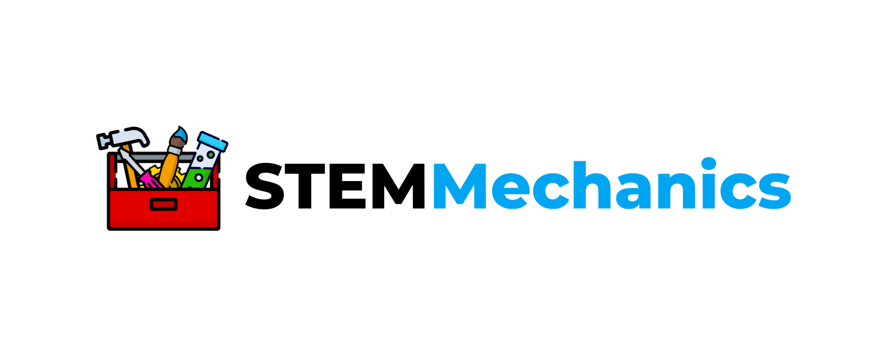

<p align="center"></p>

# Minecraft Scripts

Minecraft management scripts for tmux and server backup to [Backblaze](https://www.backblaze.com).

`service.sh` are based on the awesome work by https://github.com/moonlight200/minecraft-tmux-service
`restart.sh` and `start.sh` scripts are based on the spectatular work by https://gist.github.com/Prof-Bloodstone/6367eb4016eaf9d1646a88772cdbbac5

We previously has the server startup using systemd, however with these scripts we now run the server from cron restart.

The config `spigot.yml` needs the following changes:

```
settings:
    restart-script: ./restart.sh
```

this will call the restart script on crash or if the command `/restart` is run from Minecraft.


👋 [@STEMMechanics](https://twitter.com/STEMMechanics)
